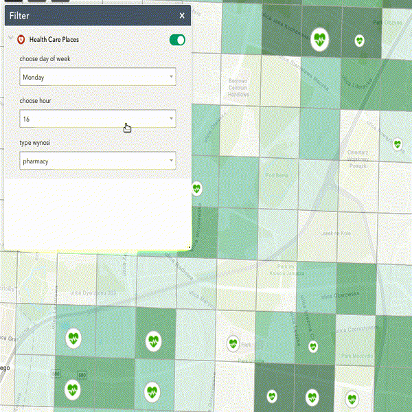

Why R? 2019 hackathon project 
================

This repository contains our solution during WhyR hackaton 2019.

We created application which allows to navigate on the Warsaw map and observe localisation oh the healthcare services with relation to demography of specific place.

Data provided by hackaton organizers contains various places located in Warsaw, such as restaurants, shops, markets and other services. From the data we selected only locations with healtcare services (dentist, doctor, hospital, pharmacy), which is 12% of the total data.

We performed analysis and visualisation to exclude unimportant columns and data with missing values.

Features
================
* occupancy index  with filter by days, hours of
* 4 class of places: dentist, doctor, hospital, pharmacy
* background of map- population density

Usage
===============
Our tool is available on the link:

https://bezpieczenstwo.maps.arcgis.com/apps/webappviewer/index.html?id=ed0a2d0207b94cf48ab241ebb5a64f2d

  

For Developers
===============
### R
Data Engineering part is located in scripts directory. Most part of work was done in R - it creates some charts and output places_healthcare.csv. 
### Python
Most work is done using pandas.  
In csv_generator.py is data concatenation - popular_times_1 + popular_times_2 -> popular_times  
Finally popular times is merged with places_healthcare.csv - its output is data.csv file.
### ArcGIS
Awesome visualization is done by merging data.csv file with external data - population density.

Event Details
=============

-   Website: [whyr.pl/2019/hackathon](http://whyr.pl/2019/hackathon)
-   Place: Faculty of Economic Sciences, University of Warsaw
-   Address: Długa 44/50, Warsaw
-   Date: 26.09.2019
-   Start - open doors: 8:30
-   Presentations: 17:00 - 18:00
-   End - closing remarks: 18:00
-   **For?** For everyone interested in data visualizations and data presentation!
-   **Tech?** No tech skills are needed to participate in the event!
